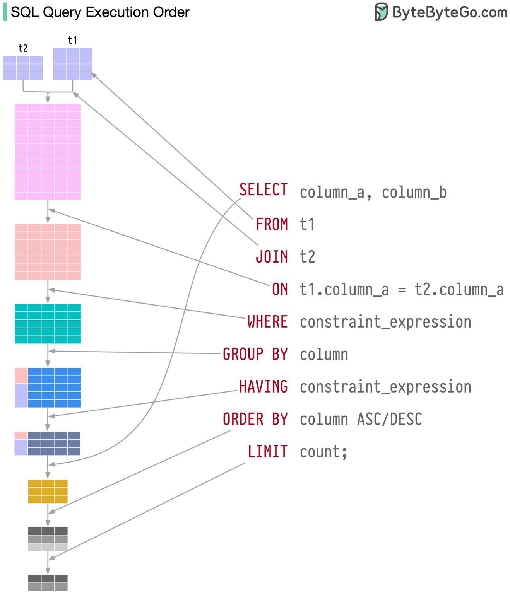

Visualizing SQL Queries

A mental model can help visualize how SQL queries are executed. Conceptually, SQL statements can be thought of as executing in this sequence:

1. FROM: Tables are identified and joined to create the initial dataset.

2. WHERE: Filters are applied to the initial dataset based on specified criteria.

3. GROUP BY: The filtered rows are grouped according to the specified columns.

4. HAVING: Additional filters are applied to the grouped rows based on aggregate criteria.

5. SELECT: Specific columns are chosen from the resultant dataset for the output.

6. ORDER BY: The output rows are sorted by the specified columns in ascending or descending order.

7. LIMIT: The number of rows in the output is restricted.

In reality, the actual execution sequence may differ from this mental model due to optimization strategies employed by the query optimizer. The query optimizer:

- Parses the SQL statements

- Translates them into relational algebra

- Applies optimization procedures

- Generates an execution plan

Even though the actual execution plan may vary due to optimization, this mental model remains a valuable visualization for understanding the core logic of SQL queries.

Credit: Sahn LamSahn 